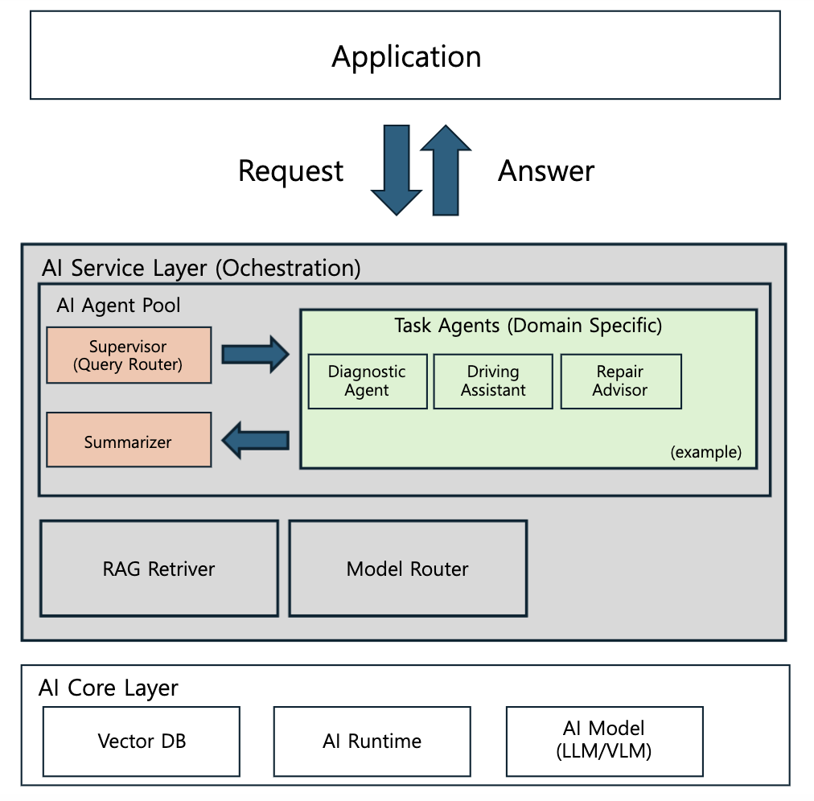

# Agentic RAG Platform

Multi-agent orchestration platform with RAG pipeline, designed as a reusable AI Service Layer.

## Architecture



### Layers

**Application**
- Sends requests and receives answers from the AI Service Layer.

**AI Service Layer (Orchestration)**
- **Supervisor (Query Router)**: Classifies incoming requests and routes them to the appropriate Task Agent.
- **Task Agents (Domain Specific)**: Specialist agents that handle domain-specific tasks. The vehicle diagnosis scenario (Diagnostic Agent, Driving Assistant, Repair Advisor) is provided as an example implementation.
- **Summarizer**: Aggregates agent outputs into a final response.
- **RAG Retriever**: Retrieves relevant context from Vector DB to support agent reasoning.
- **Model Router**: Routes inference requests to either a local runtime or a cloud LLM API depending on configuration. Current implementation targets **local** (llama.cpp).

**AI Core Layer**
- **Vector DB**: Stores embedded documents for RAG retrieval (FAISS).
- **AI Runtime**: Local inference runtime (llama.cpp).
- **AI Model (LLM/VLM)**: Underlying models served by the runtime.

## Project Structure

```
agentic-rag-platform/
├── aip/                       # Generic orchestration layer (reusable)
│   ├── core/
│   │   ├── base_agent.py      # BaseAgent abstract class + AgentResult
│   │   ├── supervisor.py      # Query routing logic
│   │   ├── rag_retriever.py   # RAG retrieval (domain-agnostic)
│   │   ├── model_router.py    # Local / Cloud inference routing
│   │   └── summarizer.py      # Response aggregation
│   └── pipeline/
│       └── graph.py           # LangGraph pipeline assembly
│
└── examples/
    └── vehicle_diagnosis/     # Domain-specific implementation example
        ├── agents/
        │   ├── diagnostic_agent.py
        │   ├── driving_assistant.py
        │   └── repair_advisor.py
        └── app.py             # Entry point
```

## Stack

| Layer | Technology |
|-------|------------|
| Orchestration | LangGraph |
| LLM Runtime | ollama (llama.cpp 기반) |
| LLM Model | Qwen2.5:3b |
| RAG | FAISS + sentence-transformers |
| Embedding | paraphrase-multilingual-MiniLM-L12-v2 |
| API | FastAPI |

## Environment Setup

### 1. Python 의존성 설치

```bash
pip install -r requirements.txt
```

### 2. AI Core (ollama) 설치 및 모델 준비

```bash
# ollama 설치
brew install ollama

# 모델 다운로드 (약 2GB)
ollama pull qwen2.5:3b
```

### 3. ollama 서버 실행

```bash
ollama serve
```

서버가 뜨면 `http://localhost:11434` 에서 OpenAI 호환 API로 접근 가능합니다.

> **Model Router**: 현재 로컬(ollama) 기준으로 구현되어 있습니다. `aip/core/model_router.py`의 `Backend.CLOUD`로 전환하면 외부 클라우드 LLM API로 연결할 수 있습니다.

### 4. 실행

```bash
python -m examples.vehicle_diagnosis.app
```
